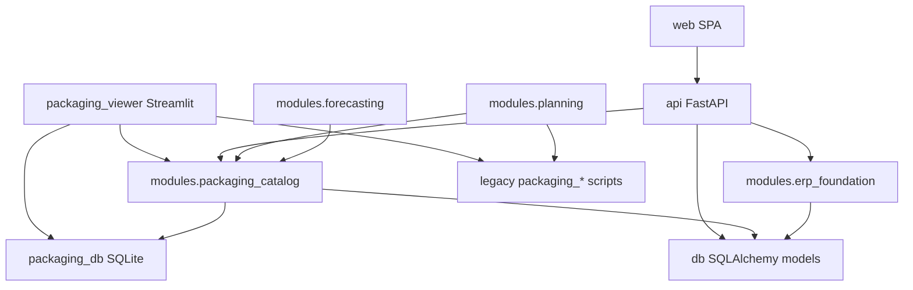

# Зависимости модулей

Документ обновляется при появлении новых модулей. Направление зависимостей: **UI/API → application → domain; application → infrastructure; не наоборот**.

## Текущий граф (упрощённо)

## Модуль `modules.packaging_catalog`

- **application:** список каталога, `excel_headers`, `excel_io`, импорт-валидация (обёртки над `packaging_schemas`).
- **infrastructure:** чтение SQLite/Postgres; репозитории `items_repository`, `monthly_repository` над `packaging_db`.
- **api:** роутер FastAPI `/api/v1/items` (монтируется в `api.main`).
- Зависит от: `packaging_db` (SQLite), `db.models` (Postgres), опционально `packaging_schemas`.

## Модуль `modules.planning`

- Мост к [`packaging_print_planning.py`](../../packaging_print_planning.py) и связанным расчётам раскладки.
- Не должен импортировать Streamlit.

## Модуль `modules.forecasting`

- Режимы горизонта и контракты: [`modules/forecasting/application/horizon_modes.py`](../../modules/forecasting/application/horizon_modes.py). Расчёты — после появления заказов/склада в Postgres.

## Модуль `modules.erp_foundation`

- Клиенты и `domain_events` (только при `PACKAGING_DATABASE_URL`). API: `/api/v1/clients`, `/api/v1/events/recent`.

## Воркер `worker/`

- Заглушка CLI: `python -m worker`. См. [`docs/observability.md`](../observability.md).

## Legacy в корне

Файлы `packaging_*.py`, `build_packaging_excel.py` и др. — **наследие**. Новый код размещается в `modules/*`; перенос — по вертикальным срезам из [`docs/packaging_viewer_slices.md`](../packaging_viewer_slices.md).
