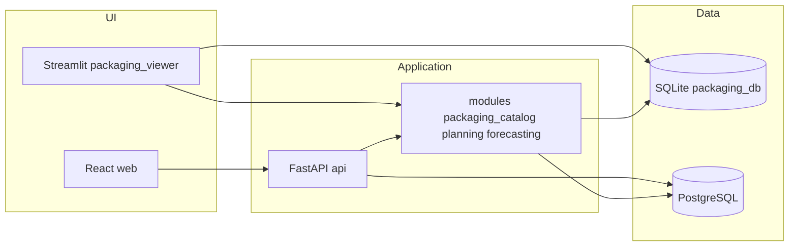

# Обзор системы (a-c)

## Назначение

Внутренний комплекс для **каталога макетов упаковки**, раскладки на печатный лист, интеграции с типографией (CG), помесячных объёмов (cutii), анализа PDF и отчётов. Целевая траектория — **модульный монолит** в духе ERP/MES ([reference bootstrap](../reference/CURSOR_ERP_BOOTSTRAP.md)).

## Текущая архитектура (высокий уровень)

## Слои

| Слой | Где | Правило |
|------|-----|---------|
| Домен / сценарии | `modules/*/application`, `modules/*/domain` | Без Streamlit и без HTTP |
| Инфраструктура | `modules/*/infrastructure`, `packaging_db.py` | БД, файлы, внешние библиотеки |
| Транспорт | `api/`, Streamlit callbacks | Тонкие адаптеры |
| UI | `packaging_viewer.py`, `web/src` | Отображение и ввод |

## Технологии

- Python 3.12+, FastAPI, SQLAlchemy 2, Alembic, PyMuPDF, openpyxl, pandas (где уже используется).
- TypeScript + Vite + React для SPA.
- PostgreSQL — целевая БД для новых ERP-сущностей и аналитики; SQLite сохраняется для совместимости и офлайн-сценариев до полного паритета.

## Связанные документы

- [Инвентаризация домена и экранов](architecture_domain_inventory.md)
- [Streamlit и продакшен](../STREAMLIT_AND_PRODUCTION.md)
- [Зависимости модулей](module-dependencies.md)
