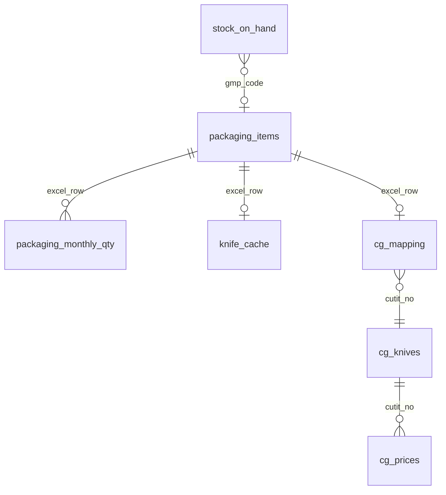

# Инвентаризация домена: сущности, экраны Streamlit, маршруты API

Документ для рефакторинга (стек, БД, UI): соответствие БД, экранов Streamlit и целевого REST API.

## Сущности БД (SQLite сегодня → Postgres завтра)

Источник правды по схеме: [`packaging_db.py`](../packaging_db.py), `init_db` и `_ensure_*`.

| Таблица | Назначение | Ключ |
|---------|------------|------|
| `packaging_items` | Каталог макетов (имя, вид, размер, PDF, цены, количества, GMP) | `excel_row` |
| `packaging_monthly_qty` | Помесячные объёмы по строке Excel | `(excel_row, year, month)` |
| `cutii_confirmations` | Сопоставление строк cutii с `excel_row` | `cutii_sheet_row` |
| `print_tariffs` | Ступени тарифа за лист | `id` |
| `print_finish_extras` | Доплаты за отделку (лак, фольга…) | `code` |
| `knife_cache` | SVG/габариты ножа из PDF | `excel_row` |
| `stock_on_hand` | Остатки по GMP | `gmp_code` |
| `cg_knives` | Справочник ножей типографии CG | `cutit_no` |
| `cg_prices` | Цены €/1000 по ножу и отделке | составной |
| `cg_mapping` | Привязка позиции к ножу CG | `excel_row` |

### ER (логические связи)

## Экраны Streamlit → черновик REST

Файл: [`packaging_viewer.py`](../packaging_viewer.py) (`main()` и вложенные `render_*`).

| Раздел / вкладка | Содержание | Предлагаемые группы API |
|------------------|------------|-------------------------|
| Макеты упаковки | Таблица строк, Excel, эталон заголовков, CG в таблице | `GET/PUT /api/v1/items`, `POST /api/v1/import/excel` |
| Печать и заявки | Лист, слоты, SVG/PDF экспорт, заявки CSV/XLSX | `GET /api/v1/print/layout`, `POST /api/v1/print/export-pdf` |
| Cutii → коробки | Матчинг, помесячный импорт | `POST /api/v1/cutii/import`, `GET /api/v1/cutii/pending` |
| Планировщик | Оптимизация, профиль Excel, экономика | `POST /api/v1/planner/optimize`, `GET /api/v1/planner/profile` |
| Анализ цветов PDF | По видам упаковки, отчёты | `POST /api/v1/analytics/color-run`, `GET /api/v1/analytics/color-report/{id}` |

Детализация эндпоинтов — по мере выноса логики из Streamlit.

## Потоки данных (кратко)

1. **Excel → сессия / БД**: чтение эталонных заголовков, слияние с SQLite по `excel_row`.
2. **Cutii XLSX → БД**: `import_cutii_forecast` → `packaging_monthly_qty` + подтверждения.
3. **Печать**: `rows_by_er` + `packaging_print_planning` + `packaging_sheet_export` → PDF/SVG.
4. **Планировщик**: те же строки + тарифы CG + `knife_cache` → слоты и стоимость.

## Следующие шаги реализации

См. репозиторий: FastAPI в [`api/`](../api/), модули [`modules/`](../modules/), Alembic, [`web/`](../web/), [`packaging_schemas/`](../packaging_schemas/), [`analytics/views.sql`](../analytics/views.sql), [`docs/STREAMLIT_AND_PRODUCTION.md`](STREAMLIT_AND_PRODUCTION.md), срезы Streamlit: [`packaging_viewer_slices.md`](packaging_viewer_slices.md).
